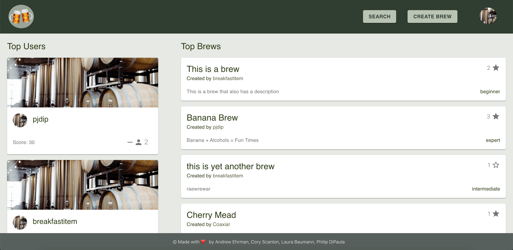
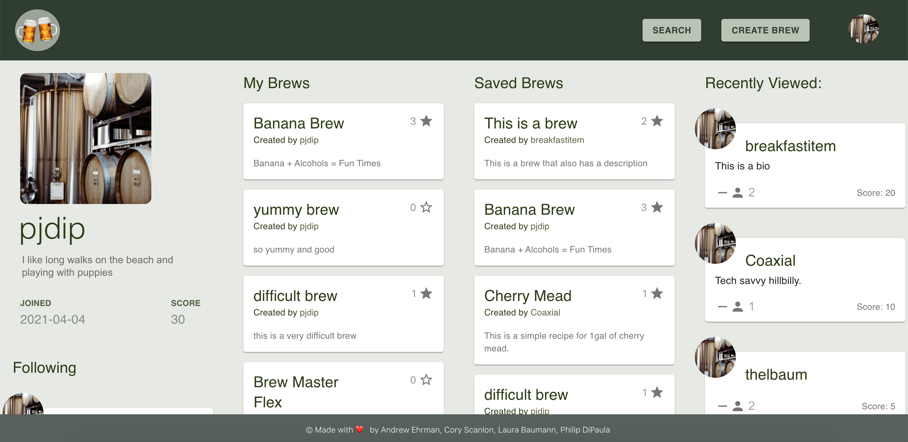
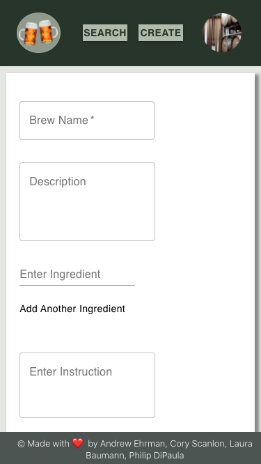
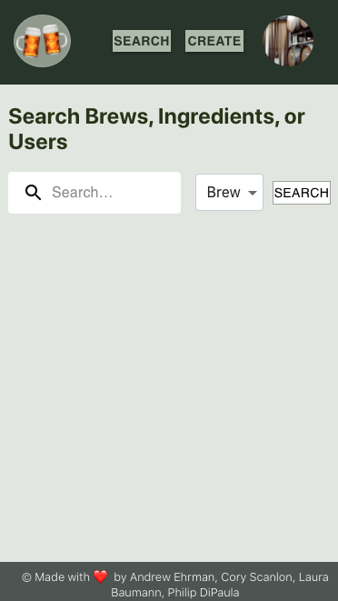

# Fun with Fermentation

* [github](https://github.com/TheCoaxial/Final-Project)
* [heroku](https://salty-dawn-64372.herokuapp.com/)

This mobile-responsive application helps users share and find fermentation recipes, as well as follow their favorite recipe contributors.

* [Installation](#installation)
* [Usage](#usage)
* [Credits](#credits)
* [License](#license)

## Installation

Installation requirements include node.js. Dependencies can be loaded by running 'npm install' from the main directory, once the repo has been cloned. Use the command "npm run start:dev" from the main directory in order to run the application locally on port 3000.

## Usage

Upon login, you will be directed to your profile page. This page is populated with your info, as well as brews you have posted, brews you have favorited, users you have followed, and recent user pages you have visited. You can favorite brews by clicking the star icon, and follow users by clicking the +person icon. The beer logo in the nav will take you to the feed page, which displays top users and posted brews. Click the name of a brew or user to be directed to the display page for that brew/user. Once there, you can find more details about them. The search button will take you to the search page, where you can search for users or brews by name/ingredient. The create button will take you to a form where you can submit your own brew recipe. The user avatar in the nav will allow you to return to your profile page or logout. Increase your contribution score by receiving likes/favorites/follows from other users on your comments/brews/profile.

In the project directory, you can run:

### `npm run start:dev`

Runs the app in the development mode.\
Open [http://localhost:3000](http://localhost:3000) to view it in the browser.

The page will reload if you make edits.\
You will also see any lint errors in the console.

### `npm run build`

Builds the app for production to the `build` folder.\
It correctly bundles React in production mode and optimizes the build for the best performance.

The build is minified and the filenames include the hashes.\
Your app is ready to be deployed!

See the section about [deployment](https://facebook.github.io/create-react-app/docs/deployment) for more information.

### `npm run eject`

**Note: this is a one-way operation. Once you `eject`, you can’t go back!**

If you aren’t satisfied with the build tool and configuration choices, you can `eject` at any time. This command will remove the single build dependency from your project.

Instead, it will copy all the configuration files and the transitive dependencies (webpack, Babel, ESLint, etc) right into your project so you have full control over them. All of the commands except `eject` will still work, but they will point to the copied scripts so you can tweak them. At this point you’re on your own.

You don’t have to ever use `eject`. The curated feature set is suitable for small and middle deployments, and you shouldn’t feel obligated to use this feature. However we understand that this tool wouldn’t be useful if you couldn’t customize it when you are ready for it.

### Learn More

You can learn more in the [Create React App documentation](https://facebook.github.io/create-react-app/docs/getting-started).

To learn React, check out the [React documentation](https://reactjs.org/).

### Code Splitting

This section has moved here: [https://facebook.github.io/create-react-app/docs/code-splitting](https://facebook.github.io/create-react-app/docs/code-splitting)

### Analyzing the Bundle Size

This section has moved here: [https://facebook.github.io/create-react-app/docs/analyzing-the-bundle-size](https://facebook.github.io/create-react-app/docs/analyzing-the-bundle-size)

### Making a Progressive Web App

This section has moved here: [https://facebook.github.io/create-react-app/docs/making-a-progressive-web-app](https://facebook.github.io/create-react-app/docs/making-a-progressive-web-app)

### Advanced Configuration

This section has moved here: [https://facebook.github.io/create-react-app/docs/advanced-configuration](https://facebook.github.io/create-react-app/docs/advanced-configuration)

### Deployment

This section has moved here: [https://facebook.github.io/create-react-app/docs/deployment](https://facebook.github.io/create-react-app/docs/deployment)

### `npm run build` fails to minify

This section has moved here: [https://facebook.github.io/create-react-app/docs/troubleshooting#npm-run-build-fails-to-minify](https://facebook.github.io/create-react-app/docs/troubleshooting#npm-run-build-fails-to-minify)

## Credits

Thanks to the following documentation:

* [React](https://reactjs.org/)
* [Express](https://expressjs.com/)
* [MySQL](https://dev.mysql.com/doc/)
* [Sequelize](https://sequelize.org/)
* [Material-UI](https://material-ui.com/)
* [Node](https://nodejs.org/en/)
* [react-router-dom](https://reactrouter.com/web/guides/quick-start)
* [react-social](https://www.npmjs.com/package/react-social)
* [jsonwebtoken](https://www.npmjs.com/package/jsonwebtoken)
* [local-storage](https://www.npmjs.com/package/local-storage)

## License

Licensed under the [GNU General Public License v3.0](https://choosealicense.com/licenses/gpl-3.0/)

---